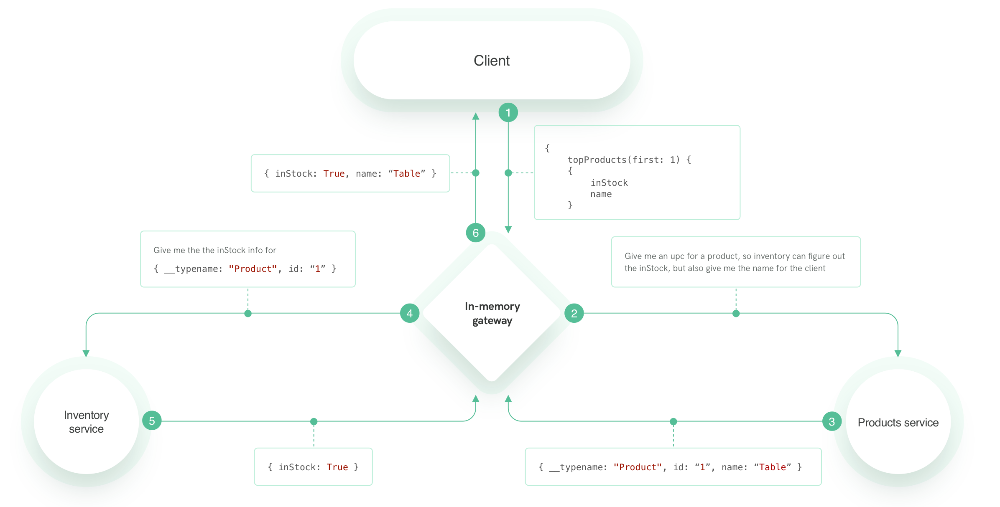

## Exercise 1

We start with a simple, standalone *products* GraphQL service. We want to turn it into a federated service, that could be used by Apollo Gateway. 

What we will be working through is the ability to use this service in a data flow as following:

## New Syntax
In this section you will learn about `__resolveReference` function, `@key` annotation
