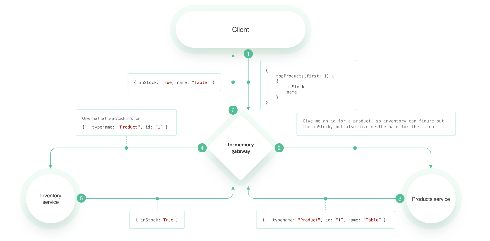

## Exercise 2

Having `products` service ready, let's create an inventory service, that will extend the Product type with information whether a given product is in stock.

The outcome of this exercise should be a functionality that allows user to query `topProducts` from `products` service but having the `inStock` information added to it from `inventory` service.

Take a loot at this chart to understand what we want to achieve:

### New Syntax
In this section you will learn about `@external` annotation.
