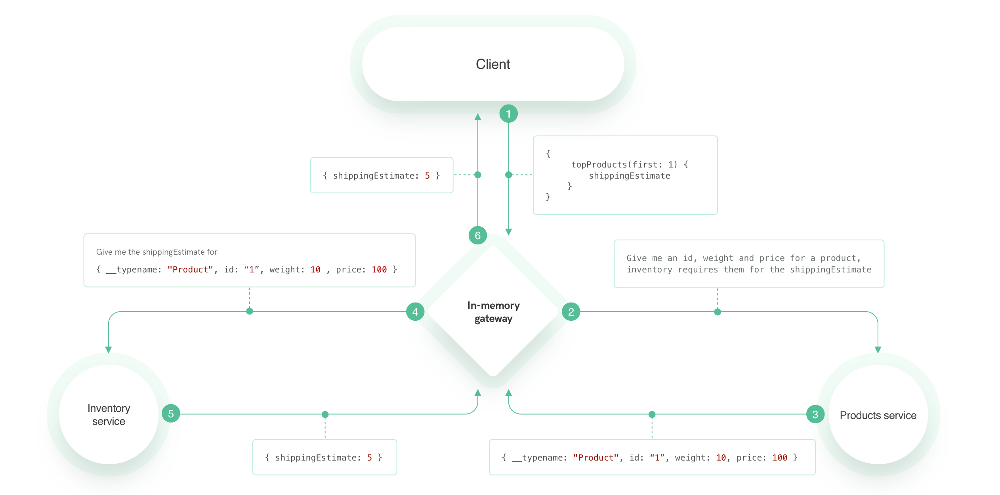

## Exercise 3

Having `products` and `inventory` services connected, we want to use the `weight` and `price` data from `products` service to calculate the `shippingEstimate` in `inventory` service. 

You will be a bit more on your own in this exercise, try to reuse the things you learned in the previous two exercises.

This is what we want to implement:

### New Syntax
In this exercise you will learn about `@requires` annotation. 
